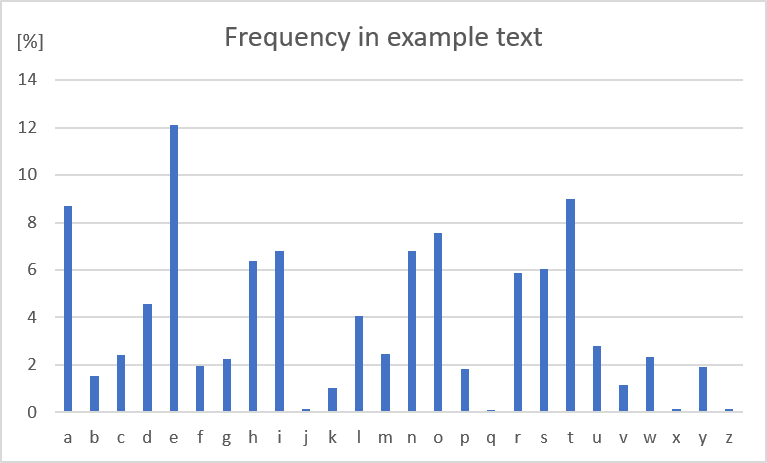

# Vigenere
> Encryption, decryption and cryptanalysis of the Vigenère cipher.

## Table of Contents
* [General Info](#general-information)
* [Technologies Used](#technologies-used)
* [Features](#features)
* [Setup](#setup)
* [Project Status](#project-status)
* [Contact](#contact)

## General Information
The program encrypts, decrypts and breaks the Vigenère cipher. 
The program encrypts the text by shifting the letters by the number specified by the key (as in the Caesar cipher). Decryption involves reversing the encryption algorithm.
The most interesting for me was the process of breaking the ciphertext. I used frequency analysis to guess the length and content of the key. The algorithm counts the frequency of the model text (the result of counting letters in The Master and Margarita by Mikhail Bulgakov is shown in the image below).

Then the program compares the result of counting the ciphertext, extending the length of the searched key. For the wrong key, the histogram differences are large. When the histograms are almost the same, the key has been found and we can decrypt the text.

## Technologies Used
- C++ 14

## Features
- Encrypting the text
- Decrypting the ciphertext
- Breaking the ciphertext

## Setup
### Encrypting:
Program loads text from files:
- original text: ../texts/encryption/text.txt
- key: ../texts/encryption/key.txt
Program loads text to file:
- result: ../texts/encryption/encryption_result.txt
### Decrypting:
Program loads text from files:
- original text: ../texts/decrypting/ciphertext.txt
- key: ../texts/decrypting/key.txt
Program loads text to file:
- result: ../texts/decrypting/descrypting_result.txt
### Cryptanalysis:
Program loads text from files:
- original text: ../texts/cryptanalysis/ciphertext.txt
Program loads text to file:
- result: ../texts/cryptanalysis/cryptanalysis_result.txt

You may change the contents of these files to encryption/decryption/break your own text.

## Project Status
Project is _complete_ 

## Contact
Created by [@jwiekieral](https://github.com/jwiekiera) - feel free to contact me!

